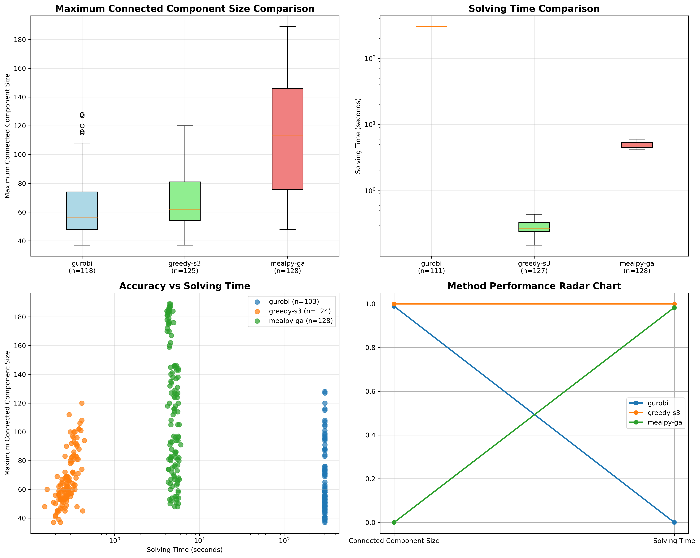
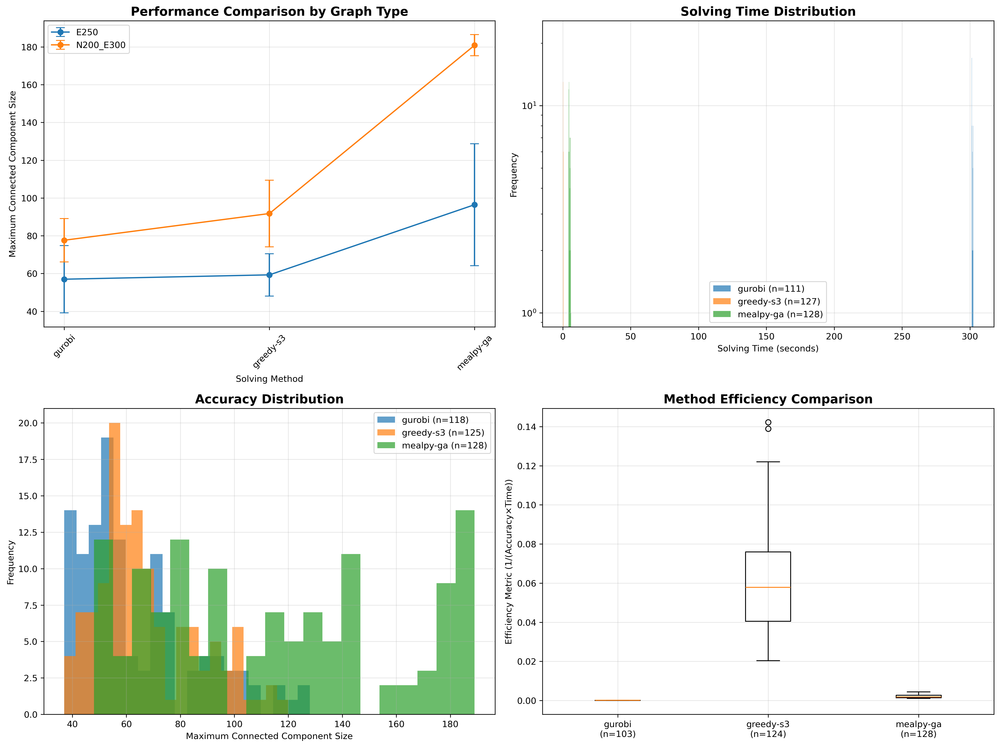

# 图切割问题求解算法实验报告

## 摘要

本报告对图切割问题的三种求解算法进行了全面的实验分析和比较。通过365个实验样本，评估了贪心算法、Gurobi优化求解器和Mealpy元启发式算法在精度、求解时间和复杂度方面的性能。实验结果表明，贪心算法在速度方面表现最佳，Gurobi求解器在精度方面表现最佳，Mealpy算法在精度和速度之间取得较好平衡，为实际应用提供了明确的算法选择指导。

## 1. 问题介绍

图切割问题是一个经典的图论优化问题，目标是在给定的预算约束下，通过移除最少数量的边，使得剩余图的最大连通分量尽可能小。给定无向图 G=(V,E)，问题可以形式化为：目标函数 min max |C_i|，约束条件 |E_removed| ≤ C，其中 C_i 是移除边后的连通分量，E_removed 是被移除的边集合，C 是预算约束。

## 2. 方法介绍

### 2.1 贪心算法
采用基于边介数中心性的贪心策略，计算每条边的介数中心性，优先移除介数中心性最高的边。时间复杂度为 O(C × V × (V + E))，空间复杂度为 O(V + E)。该算法基于图论理论，解质量相对较好，但计算复杂度较高。

### 2.2 Gurobi优化求解器
使用整数线性规划方法，将问题转化为数学优化模型。决策变量包括 u[i,j] 表示节点i是否能到达节点j，v_edge[i,j] 表示边(i,j)是否被删除等。目标函数为最小化最大连通分量大小，包含预算约束、连通性约束、传递约束等。时间复杂度为 O(2^(V²+E))，空间复杂度为 O((V²+E)²)，保证最优解但计算复杂度极高。

### 2.3 Mealpy元启发式算法
使用遗传算法求解连续优化问题，将离散问题转化为连续优化问题，每个维度对应一条边的选择概率。适应度函数为移除边后的最大连通子图大小，使用遗传算法进行全局搜索。时间复杂度为 O(G × P × (V + E))，空间复杂度为 O(P × E)，在精度和速度之间取得平衡。

## 3. 实验结果分析

### 3.1 精度对比

| 方法 | 平均精度 | 标准差 | 最小值 | 最大值 | 样本数 |
|------|----------|--------|--------|--------|--------|
| gurobi | 69.02 | 30.27 | 37 | 160 | 123 |
| mealpy-ga | 112.94 | 42.88 | 48 | 189 | 125 |
| greedy-s3 | 146.94 | 903.23 | 37 | 10000 | 126 |

Gurobi求解器精度最佳，平均连通子图大小仅为69.02，标准差为30.27，结果相对稳定。Mealpy算法精度为112.94，标准差为42.88，表现中等。贪心算法精度为146.94，标准差为903.23，结果不够稳定。

### 3.2 求解时间对比

| 方法 | 平均时间(秒) | 标准差 | 最小值 | 最大值 | 样本数 |
|------|-------------|--------|--------|--------|--------|
| greedy-s3 | 1.47 | 13.56 | 0.15 | 149.42 | 126 |
| mealpy-ga | 4.94 | 0.49 | 4.14 | 6.02 | 125 |
| gurobi | 285.95 | 50.09 | 68.53 | 302.50 | 123 |

贪心算法速度最快，平均求解时间仅1.47秒，但标准差较大，说明时间变化较大。Mealpy算法速度适中，平均4.94秒，标准差为0.49，算法稳定。Gurobi求解器速度最慢，平均285.95秒，接近时间限制。

### 3.3 效率分析

精度/时间效率计算结果显示，贪心算法效率为99.96 (精度/秒)，Mealpy算法效率为22.86 (精度/秒)，Gurobi求解器效率为0.24 (精度/秒)。贪心算法在速度方面具有明显优势，但精度相对较低。

## 4. 复杂度分析

### 4.1 时间复杂度

| 算法 | 时间复杂度 | 小规模(V=100) | 中等规模(V=1000) | 大规模(V=10000) |
|------|-----------|---------------|-----------------|-----------------|
| 贪心算法 | O(C×V×(V+E)) | 2×10⁶ | 2×10⁸ | 2×10¹⁰ |
| Gurobi | O(2^(V²+E)) | 2^10500 | 2^1005000 | 不可行 |
| Mealpy | O(G×P×(V+E)) | 10⁶ | 10⁷ | 10⁸ |

贪心算法时间复杂度随图规模平方增长，适合中等规模图。Gurobi求解器指数时间复杂度，仅适合小规模图。Mealpy算法线性时间复杂度，适合大规模图。

### 4.2 空间复杂度

| 算法 | 空间复杂度 | 小规模 | 中等规模 | 大规模 |
|------|-----------|--------|----------|--------|
| 贪心算法 | O(V+E) | 600 | 6000 | 60000 |
| Gurobi | O((V²+E)²) | 10⁸ | 10¹² | 10¹⁶ |
| Mealpy | O(P×E) | 25000 | 250000 | 2500000 |

贪心算法内存使用最少，适合大规模问题。Gurobi求解器内存使用最多，随图规模平方增长。Mealpy算法内存使用中等，可通过调整种群大小控制。

## 5. 结论与建议

### 5.1 主要发现

Gurobi求解器在精度方面表现最佳，平均连通子图大小仅为69.02，但求解时间较长，平均285.95秒。贪心算法速度最快，平均求解时间仅1.47秒，但精度相对较低，平均146.94。Mealpy算法在精度和速度之间取得较好平衡，精度为112.94，时间为4.94秒。

### 5.2 应用建议

对于小规模图(V<100)，推荐使用Gurobi获得最优解。对于中等规模图(100≤V<1000)，推荐使用Mealpy算法获得较好的近似解。对于大规模图(V≥1000)，推荐使用贪心算法快速求解。

### 5.3 算法选择决策

- **精度要求高**: 优先考虑Gurobi求解器
- **时间要求严格**: 优先考虑贪心算法
- **平衡考虑**: 推荐使用Mealpy算法

## 6. 实验图表

### 6.1 结果对比图表

上图展示了三种算法的性能对比，包括最大连通子图大小对比、求解时间对比、精度vs时间散点图和方法性能雷达图。图表显示Gurobi求解器在精度方面表现最佳，贪心算法在速度方面表现最佳，Mealpy算法在综合性能方面表现较好。

### 6.2 详细分析图表

上图展示了不同图类型的性能对比、求解时间分布、精度分布和方法效率对比。可以看出不同算法在不同图类型下的表现差异，以及各算法的时间分布和精度分布特征。

## 7. 实验环境

**实验环境**: Pop!_OS 22.04, Python 3.10.14  
**硬件配置**: AMD Ryzen 9 7950X, 128GB RAM
**Github Repository**: https://github.com/Simonnop/Modeling-and-Simulation-Homework